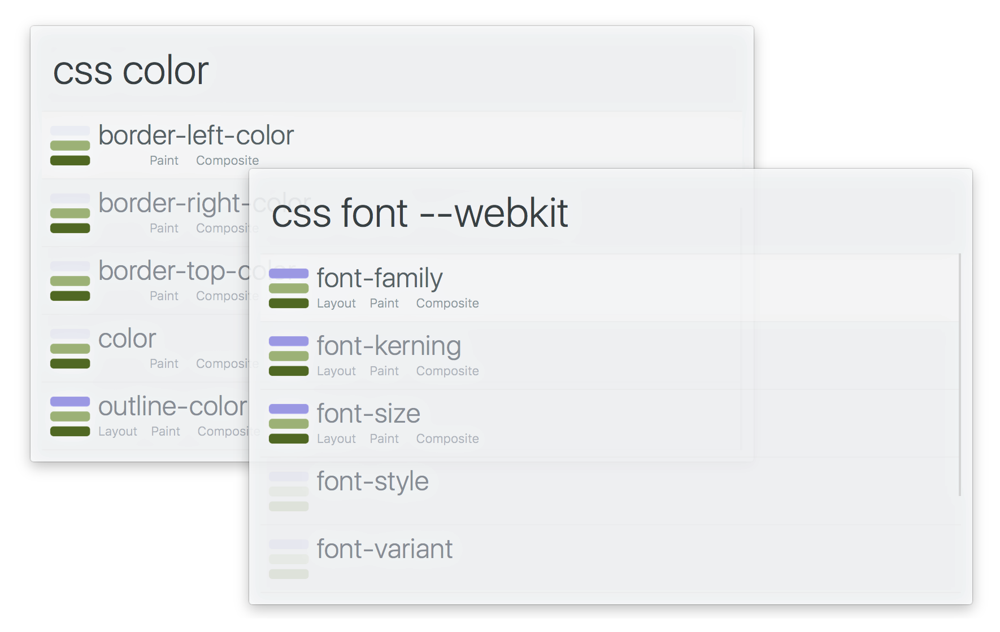

# alfred-css-triggers [](https://travis-ci.org/SamVerschueren/alfred-css-triggers)

> Search through [csstriggers.com](https://csstriggers.com/)




## Install

```
$ npm install --global alfred-css-triggers
```

*Requires [Node.js](https://nodejs.org) 4+ and the Alfred [Powerpack](https://www.alfredapp.com/powerpack/).*


## Usage

In Alfred, type `css`, <kbd>Enter</kbd>, and your query.

Select an item and press <kbd>Enter</kbd> to go to the [csstriggers.com](https://csstriggers.com) documentation.<br>
Hold <kbd>Alt</kbd> to show the subsequent update pipeline.


## Related

- [alfred-updater](https://github.com/samverschueren/alfred-updater) - Workflow updater
- [alfy](https://github.com/sindresorhus/alfy) - Create Alfred workflows with ease


## License

MIT © [Sam Verschueren](https://github.com/SamVerschueren)
